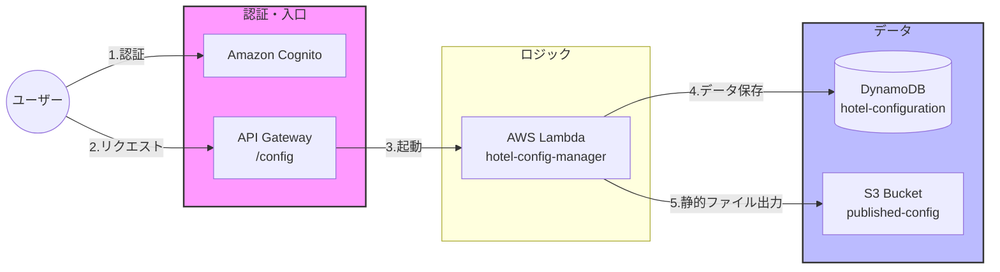

Hotel Management System - Infrastructure (IaC)

AWS SAA（Solution Architect Associate）の知識を活かし、Terraformを用いて構築したホテル予約システムの「設定管理（Configuration）サービス」用インフラ基盤です。

システム構成図

参照元資料（画像左のconfigurationを基に作成しました。）

URL：https://d1.awsstatic.com/architecture-diagrams/ArchitectureDiagrams/serverless-reservation-system-on-aws-ra.pdf

IaC: Terraform (v1.14.6)
Cloud: AWS
Network: VPC (3-tier Architecture)
Storage/DB: Amazon DynamoDB, Amazon S3
Security: IAM (Principle of Least Privilege)

 設計のポイント
1. オンプレ経験を活かした堅牢なVPC設計
    Public/Private/Databaseの3層レイヤーに分け、適切なサブネット配置を実施。
   オンプレミス環境からの移行を見据えた、拡張性の高いCIDR設計。

3. DynamoDB × S3 による「疎結合」なアーキテクチャ
   マスターデータはDynamoDBで管理し、配信用の設定ファイルは S3 へパブリッシュ。
   読み取りと書き込みのフローを分離することで、管理画面の負荷が予約ユーザーに影響しない設計を採用。

4. 最小権限の原則 (Least Privilege)
   IAM Role/Policyにおいて、特定のリソース（ARN）に対して必要なアクションのみを許可。セキュリティのベストプラクティスを徹底しました。

今後のロードマップ
 API Gateway + Lambda によるサーバーレスAPIの実装
 Amazon Cognito による管理者認証の追加
VPCエンドポイントの導入によるセキュアな閉域接続の強化

